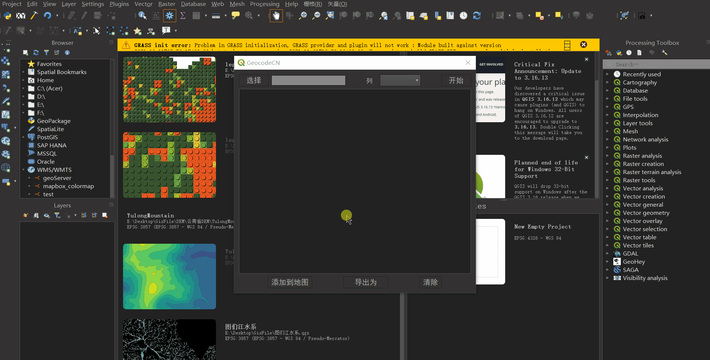

### GeocodeCN

一个Qgis插件，用于地理编码，地址——> 坐标，其特点如下

> 1. 批量将地址转为坐标
> 2. 坐标转换，百度坐标-->WGS84，百度坐标-->GCJ2000，该功能实现依赖
> 3. 直接生成Qgis临时点图层或导出为csv文件

### 使用方法：

> 1.克隆本仓库或者下载为.zip文件
>
> 2. 置于Qgis插件路径下/或者直接使用.zip安装方

### 效果：

